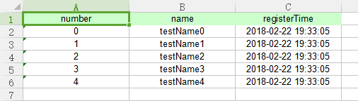
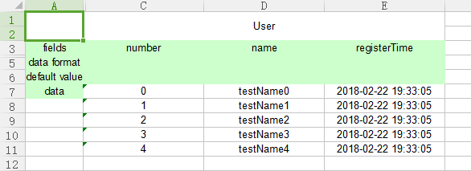
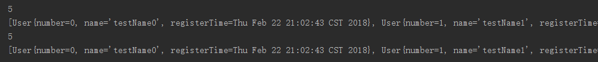
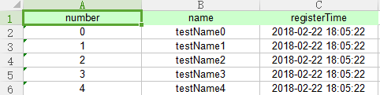
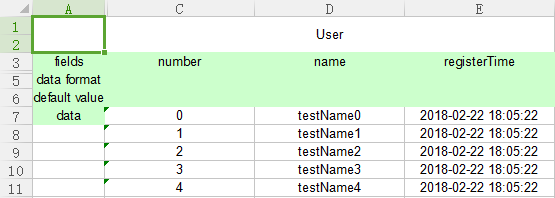
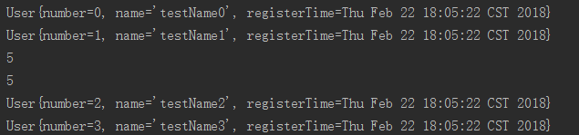
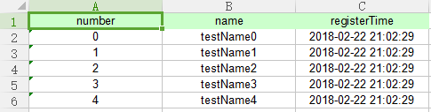
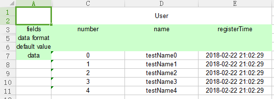
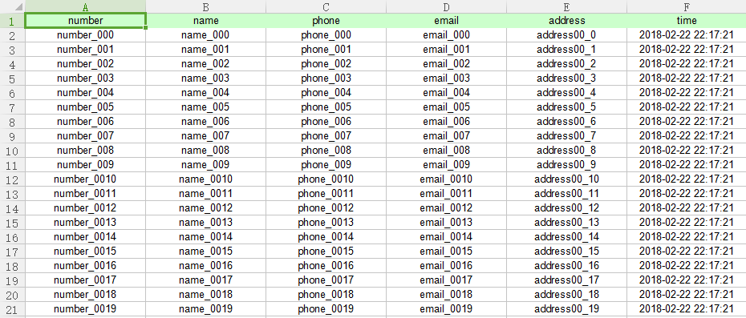
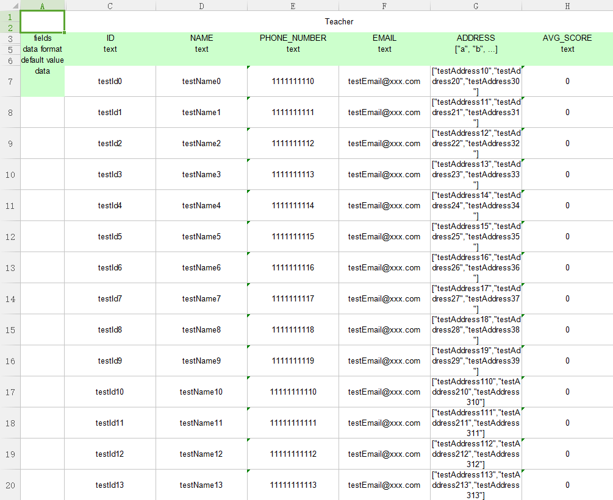

# java2excel

Tool for java reading/writing excel file.

## Install 
- clone project into local disk
```
git clone https://github.com/johnsonmoon/java2excel.git
```
- checkout branch dev-1.3.0 , switch into version 1.3.0
```
git checkout origin/dev-1.3.0
```
- install apache maven, execute command below in the project directory 
```
mvn install
```

## Include java2excel into your project path (maven)
- pom.xml
```
<dependency>
    <groupId>xuyihao</groupId>
    <artifactId>java2excel</artifactId>
    <version>1.3.0</version>
</dependency>
```

## Using
There are a few ways to edit/write/read excel file with java2excel tool.

### Interface & Class

number | name | interface or class | description
--- | --- | --- | ---
1 | Editor | interface | interface for edit excel file (including read & write)
2 | Reader | interface | interface for read data from excel file
3 | Writer | interface | interface for write data into excel file
4 | CustomEditor | class | class implements Editor, custom editing excel file (including read & write)
5 | CustomReader | class | class implements Reader, custom reading data from excel file
6 | CustomWriter | class | class implements Writer, custom writing data into excel file
7 | FormattedEditor | class | class implements Editor, editing excel file with formatted way
8 | FormattedReader | class | class implements Reader, reading data from excel file with formatted way
9 | FormattedWriter | class | class implements Writer, writing data into excel file with formatted way

### Example
Before coding your function for read or write excel file, fist of all you need to code your entity class, for example class User:
```
import java.util.Date;

public class User {
    private int number;
    private String name;
    private Date registerTime;

    public int getNumber() {
        return number;
    }

    public void setNumber(int number) {
        this.number = number;
    }

    public String getName() {
        return name;
    }

    public void setName(String name) {
        this.name = name;
    }

    public Date getRegisterTime() {
        return registerTime;
    }

    public void setRegisterTime(Date registerTime) {
        this.registerTime = registerTime;
    }

    @Override
    public String toString() {
        return "User{" +
                "number=" + number +
                ", name='" + name + '\'' +
                ", registerTime=" + registerTime +
                '}';
    }
}
```

After finishing the entity class, you may write your codes for read and write excel file.

#### Editor
```
String filePathName = System.getProperty("user.dir") + "/src/test/resources/editor.xlsx";
List<User> users = new ArrayList<>();
for (int i = 0; i < 5; i++) {
    User user = new User();
    user.setName("testName" + i);
    user.setNumber(i);
    user.setRegisterTime(new Date());
    users.add(user);
}

//CustomEditor write
Editor editorCustom = ExcelFactory.getEditor(ExcelFactory.TYPE_CODE_CUSTOM, filePathName, 1);
editorCustom.writeExcelMetaInfo(User.class, 0);
editorCustom.writeExcelData(users, 0, 1);
editorCustom.flush();
editorCustom.close();

//FormattedEditor write
Editor editorFormatted = ExcelFactory.getEditor(ExcelFactory.TYPE_CODE_FORMATTED, filePathName);
editorFormatted.writeExcelMetaInfo(User.class, 1);
editorFormatted.writeExcelData(users, 1, 0);
editorFormatted.flush();
editorFormatted.close();

//CustomEditor read
Editor editorCustomRead = ExcelFactory.getEditor(ExcelFactory.TYPE_CODE_CUSTOM, filePathName, 1);
System.out.println(editorCustomRead.readExcelDataCount(0));
System.out.println(editorCustomRead.readExcelData(0, 1, 5, User.class));
editorCustomRead.close();

//FormattedEditor read
Editor editorFormattedRead = ExcelFactory.getEditor(ExcelFactory.TYPE_CODE_FORMATTED, filePathName);
System.out.println(editorFormattedRead.readExcelDataCount(1));
System.out.println(editorFormattedRead.readExcelData(1, 0, 5, User.class));
editorFormattedRead.close();
```

result like this

- CustomEditor write



- FormattedEditor write



- Editor read



#### Reader

file for reader

- CustomReader



- FormattedReader



```
//CustomReader
String filePathNameCustom = System.getProperty("user.dir") + "/src/test/resources/readerCustom.xlsx";
Reader readerCustom = ExcelFactory.getReader(ExcelFactory.TYPE_CODE_CUSTOM, filePathNameCustom, 1);
readerCustom.readExcelData(0, 2, User.class).forEach(System.out::println);
System.out.println(readerCustom.readExcelDataCount(0));
readerCustom.close();

//FormattedReader
String filePathNameFormatted = System.getProperty("user.dir") + "/src/test/resources/readerFormatted.xlsx";
Reader readerFormatted = ExcelFactory.getReader(ExcelFactory.TYPE_CODE_FORMATTED, filePathNameFormatted);
System.out.println(readerFormatted.readExcelDataCount(0));
readerCustom.readExcelData(0, 2, User.class).forEach(System.out::println);
readerFormatted.close();
```

result like this




#### Writer
```
List<User> users = new ArrayList<>();
for (int i = 0; i < 5; i++) {
    User user = new User();
    user.setName("testName" + i);
    user.setNumber(i);
    user.setRegisterTime(new Date());
    users.add(user);
}

//CustomWriter
String filePathNameCustom = System.getProperty("user.dir") + "/src/test/resources/writerCustom.xlsx";
Writer writerCustom = ExcelFactory.getWriter(ExcelFactory.TYPE_CODE_CUSTOM, filePathNameCustom);
writerCustom.writeExcelMetaInfo(User.class, 0);
writerCustom.writeExcelData(users, 0);
writerCustom.flush();
writerCustom.close();

//FormattedWriter
String filePathNameFormatted = System.getProperty("user.dir") + "/src/test/resources/writerFormatted.xlsx";
Writer writerFormatted = ExcelFactory.getWriter(ExcelFactory.TYPE_CODE_FORMATTED, filePathNameFormatted);
writerFormatted.writeExcelMetaInfo(User.class, 0);
writerFormatted.writeExcelData(users, 0);
writerFormatted.flush();
writerFormatted.close();
```

result like this

- CustomWriter



- FormattedWriter



### Custom Editor&Writer&Reader
#### Code your entity class
There are two ways. One is the ordinary way, another is to add @Column annotation way.

##### 1.Ordinary ways (like class Person):
```
import java.util.Date;

public class Person {
	private String number;
	private String name;
	private String phone;
	private String email;
	private String address;
	private Date time;

	public String getNumber() {
		return number;
	}

	public void setNumber(String number) {
		this.number = number;
	}

	public String getName() {
		return name;
	}

	public void setName(String name) {
		this.name = name;
	}

	public String getPhone() {
		return phone;
	}

	public void setPhone(String phone) {
		this.phone = phone;
	}

	public String getEmail() {
		return email;
	}

	public void setEmail(String email) {
		this.email = email;
	}

	public String getAddress() {
		return address;
	}

	public void setAddress(String address) {
		this.address = address;
	}

	public Date getTime() {
		return time;
	}

	public void setTime(Date time) {
		this.time = time;
	}

	@Override
	public String toString() {
		return "Person{" +
				"number='" + number + '\'' +
				", name='" + name + '\'' +
				", phone='" + phone + '\'' +
				", email='" + email + '\'' +
				", address='" + address + '\'' +
				", time=" + time +
				'}';
	}
}
```

##### 2.Annotation ways (like class PersonA):
```
import xuyihao.java2excel.core.entity.custom.annotation.Column;

import java.util.Date;

public class PersonA {
	@Column(column = 0)
	private String number;
	@Column(column = 1)
	private String name;
	@Column(column = 2)
	private String phone;
	@Column(column = 3)
	private String email;
	private String address;
	@Column(column = 4)
	private Date time;

	public String getNumber() {
		return number;
	}

	public void setNumber(String number) {
		this.number = number;
	}

	public String getName() {
		return name;
	}

	public void setName(String name) {
		this.name = name;
	}

	public String getPhone() {
		return phone;
	}

	public void setPhone(String phone) {
		this.phone = phone;
	}

	public String getEmail() {
		return email;
	}

	public void setEmail(String email) {
		this.email = email;
	}

	public String getAddress() {
		return address;
	}

	public void setAddress(String address) {
		this.address = address;
	}

	public Date getTime() {
		return time;
	}

	public void setTime(Date time) {
		this.time = time;
	}

	@Override
	public String toString() {
		return "PersonA{" +
				"number='" + number + '\'' +
				", name='" + name + '\'' +
				", phone='" + phone + '\'' +
				", email='" + email + '\'' +
				", address='" + address + '\'' +
				", time=" + time +
				'}';
	}
}
```

#### Write your entity data into excel file using class {CustomWriter}
```
String fileDir = System.getProperty("user.dir") + File.separator + "src/test/resources";
List<Person> people = new ArrayList<>();

for (int i = 0; i < 20; i++) {
    Person person = new Person();
    person.setNumber("number_00" + i);
    person.setName("name_00" + i);
    person.setPhone("phone_00" + i);
    person.setEmail("email_00" + i);
    person.setAddress("address00_" + i);
    person.setTime(DateUtils.currentDateTimeForDate());
    people.add(person);
}

CustomWriter writer = new CustomWriter(fileDir + "/testCustomWriter.xlsx");
writer.writeExcelMetaInfo(Person.class, 0);
writer.writeExcelData(people, 0);
writer.flush();
writer.close();
```
Result:



#### Read your entity data from a existing excel file using class {CustomReader}. (Wrote before)
```
String filePathName = System.getProperty("user.dir") + File.separator + "src/test/resources/testCustomReader.xlsx";
List<Person> people = new ArrayList<>();

for (int i = 0; i < 20; i++) {
    Person person = new Person();
    person.setNumber("number_00" + i);
    person.setName("name_00" + i);
    person.setPhone("phone_00" + i);
    person.setEmail("email_00" + i);
    person.setAddress("address00_" + i);
    person.setTime(DateUtils.currentDateTimeForDate());
    people.add(person);
}
CustomWriter writer = new CustomWriter(filePathName);
writer.writeExcelMetaInfo(Person.class, 0);
writer.writeExcelData(people, 0);
writer.flush();
writer.close();

CustomReader reader = new CustomReader(filePathName, 1);
long count = reader.readExcelDataCount(0);
System.out.println(count);
List<Person> personList;
do {
    personList = reader.readExcelData(0, 10, Person.class);
    personList.forEach(System.out::println);
} while (!personList.isEmpty());

reader.refresh();

System.out.println("\r\r-----------------------------\r\r");

Person[] personArray = new Person[10];
int readLength;
while ((readLength = reader.readExcelData(0, personArray, Person.class)) > 0) {
    for (int i = 0; i < readLength; i++) {
        System.out.println(personArray[i]);
    }
}

reader.close();
```
Result:

```
20
Person{number='number_000', name='name_000', phone='phone_000', email='email_000', address='address00_0', time=Thu Feb 22 22:21:58 CST 2018}
Person{number='number_001', name='name_001', phone='phone_001', email='email_001', address='address00_1', time=Thu Feb 22 22:21:58 CST 2018}
Person{number='number_002', name='name_002', phone='phone_002', email='email_002', address='address00_2', time=Thu Feb 22 22:21:58 CST 2018}
Person{number='number_003', name='name_003', phone='phone_003', email='email_003', address='address00_3', time=Thu Feb 22 22:21:58 CST 2018}
Person{number='number_004', name='name_004', phone='phone_004', email='email_004', address='address00_4', time=Thu Feb 22 22:21:58 CST 2018}
Person{number='number_005', name='name_005', phone='phone_005', email='email_005', address='address00_5', time=Thu Feb 22 22:21:58 CST 2018}
Person{number='number_006', name='name_006', phone='phone_006', email='email_006', address='address00_6', time=Thu Feb 22 22:21:58 CST 2018}
Person{number='number_007', name='name_007', phone='phone_007', email='email_007', address='address00_7', time=Thu Feb 22 22:21:58 CST 2018}
Person{number='number_008', name='name_008', phone='phone_008', email='email_008', address='address00_8', time=Thu Feb 22 22:21:58 CST 2018}
Person{number='number_009', name='name_009', phone='phone_009', email='email_009', address='address00_9', time=Thu Feb 22 22:21:58 CST 2018}
Person{number='number_0010', name='name_0010', phone='phone_0010', email='email_0010', address='address00_10', time=Thu Feb 22 22:21:58 CST 2018}
Person{number='number_0011', name='name_0011', phone='phone_0011', email='email_0011', address='address00_11', time=Thu Feb 22 22:21:58 CST 2018}
Person{number='number_0012', name='name_0012', phone='phone_0012', email='email_0012', address='address00_12', time=Thu Feb 22 22:21:58 CST 2018}
Person{number='number_0013', name='name_0013', phone='phone_0013', email='email_0013', address='address00_13', time=Thu Feb 22 22:21:58 CST 2018}
Person{number='number_0014', name='name_0014', phone='phone_0014', email='email_0014', address='address00_14', time=Thu Feb 22 22:21:58 CST 2018}
Person{number='number_0015', name='name_0015', phone='phone_0015', email='email_0015', address='address00_15', time=Thu Feb 22 22:21:58 CST 2018}
Person{number='number_0016', name='name_0016', phone='phone_0016', email='email_0016', address='address00_16', time=Thu Feb 22 22:21:58 CST 2018}
Person{number='number_0017', name='name_0017', phone='phone_0017', email='email_0017', address='address00_17', time=Thu Feb 22 22:21:58 CST 2018}
Person{number='number_0018', name='name_0018', phone='phone_0018', email='email_0018', address='address00_18', time=Thu Feb 22 22:21:58 CST 2018}
Person{number='number_0019', name='name_0019', phone='phone_0019', email='email_0019', address='address00_19', time=Thu Feb 22 22:21:58 CST 2018}

Person{number='number_000', name='name_000', phone='phone_000', email='email_000', address='address00_0', time=Thu Feb 22 22:21:58 CST 2018}
Person{number='number_001', name='name_001', phone='phone_001', email='email_001', address='address00_1', time=Thu Feb 22 22:21:58 CST 2018}
Person{number='number_002', name='name_002', phone='phone_002', email='email_002', address='address00_2', time=Thu Feb 22 22:21:58 CST 2018}
Person{number='number_003', name='name_003', phone='phone_003', email='email_003', address='address00_3', time=Thu Feb 22 22:21:58 CST 2018}
Person{number='number_004', name='name_004', phone='phone_004', email='email_004', address='address00_4', time=Thu Feb 22 22:21:58 CST 2018}
Person{number='number_005', name='name_005', phone='phone_005', email='email_005', address='address00_5', time=Thu Feb 22 22:21:58 CST 2018}
Person{number='number_006', name='name_006', phone='phone_006', email='email_006', address='address00_6', time=Thu Feb 22 22:21:58 CST 2018}
Person{number='number_007', name='name_007', phone='phone_007', email='email_007', address='address00_7', time=Thu Feb 22 22:21:58 CST 2018}
Person{number='number_008', name='name_008', phone='phone_008', email='email_008', address='address00_8', time=Thu Feb 22 22:21:58 CST 2018}
Person{number='number_009', name='name_009', phone='phone_009', email='email_009', address='address00_9', time=Thu Feb 22 22:21:58 CST 2018}
Person{number='number_0010', name='name_0010', phone='phone_0010', email='email_0010', address='address00_10', time=Thu Feb 22 22:21:58 CST 2018}
Person{number='number_0011', name='name_0011', phone='phone_0011', email='email_0011', address='address00_11', time=Thu Feb 22 22:21:58 CST 2018}
Person{number='number_0012', name='name_0012', phone='phone_0012', email='email_0012', address='address00_12', time=Thu Feb 22 22:21:58 CST 2018}
Person{number='number_0013', name='name_0013', phone='phone_0013', email='email_0013', address='address00_13', time=Thu Feb 22 22:21:58 CST 2018}
Person{number='number_0014', name='name_0014', phone='phone_0014', email='email_0014', address='address00_14', time=Thu Feb 22 22:21:58 CST 2018}
Person{number='number_0015', name='name_0015', phone='phone_0015', email='email_0015', address='address00_15', time=Thu Feb 22 22:21:58 CST 2018}
Person{number='number_0016', name='name_0016', phone='phone_0016', email='email_0016', address='address00_16', time=Thu Feb 22 22:21:58 CST 2018}
Person{number='number_0017', name='name_0017', phone='phone_0017', email='email_0017', address='address00_17', time=Thu Feb 22 22:21:58 CST 2018}
Person{number='number_0018', name='name_0018', phone='phone_0018', email='email_0018', address='address00_18', time=Thu Feb 22 22:21:58 CST 2018}
Person{number='number_0019', name='name_0019', phone='phone_0019', email='email_0019', address='address00_19', time=Thu Feb 22 22:21:58 CST 2018}
```


### Formatted Editor&Writer&Reader
#### Code your entity class
There are two ways. One is code your entity class like you always do, another way is to add @Model/@Attribute annotation.

##### 1.Ordinary ways (like class Student):
```
import java.util.List;

/**
 * Created by xuyh at 2017/12/30 16:44.
 */
public class Student {
	public static final String COLLECTION_NAME = "Student";
	public static String FIELD_CODE_NAME = "name";
	private static String KIND = "UNKNOWN";
	private String name;
	private String number;
	private String phoneNumber;
	private String email;
	private int score;
	private double avgScore;
	private List<String> addresses;

	public Student() {
	}

	public Student(String name, String number, String phoneNumber, String email) {
		this.name = name;
		this.number = number;
		this.phoneNumber = phoneNumber;
		this.email = email;
	}

	public String getName() {
		return name;
	}

	public void setName(String name) {
		this.name = name;
	}

	public String getNumber() {
		return number;
	}

	public void setNumber(String number) {
		this.number = number;
	}

	public String getPhoneNumber() {
		return phoneNumber;
	}

	public void setPhoneNumber(String phoneNumber) {
		this.phoneNumber = phoneNumber;
	}

	public String getEmail() {
		return email;
	}

	public void setEmail(String email) {
		this.email = email;
	}

	public List<String> getAddresses() {
		return addresses;
	}

	public void setAddresses(List<String> addresses) {
		this.addresses = addresses;
	}

	public int getScore() {
		return score;
	}

	public void setScore(int score) {
		this.score = score;
	}

	public double getAvgScore() {
		return avgScore;
	}

	public void setAvgScore(double avgScore) {
		this.avgScore = avgScore;
	}

	@Override
	public String toString() {
		return "Student{" +
				"name='" + name + '\'' +
				", number='" + number + '\'' +
				", phoneNumber='" + phoneNumber + '\'' +
				", email='" + email + '\'' +
				", score=" + score +
				", avgScore=" + avgScore +
				", addresses=" + addresses +
				'}';
	}
}

```  

##### annotation ways (like class Teacher):
```
import xuyihao.java2excel.core.entity.formatted.model.annotation.Attribute;
import xuyihao.java2excel.core.entity.formatted.model.annotation.Model;

import java.util.List;

/**
 * Created by xuyh at 2018/1/3 13:41.
 */
@Model(name = "Teacher")
public class Teacher {
	public static final String COLLLECTION_NAME = "Teacher";
	public static final String FIELD_CODE_ID = "id";
	public static final String FIELD_CODE_NAME = "name";
	public static final String FIELD_CODE_PHONE_NUMBER = "phoneNumber";
	public static final String FIELD_CODE_EMAIL = "email";
	public static final String FIELD_CODE_ADDRESS = "address";

	@Attribute(attrName = "ID", attrType = "String", formatInfo = "text")
	private String id;
	@Attribute(attrName = "NAME", attrType = "String", formatInfo = "text")
	private String name;
	@Attribute(attrName = "PHONE_NUMBER", attrType = "String", formatInfo = "text")
	private String phoneNumber;
	@Attribute(attrName = "EMAIL", attrType = "String", formatInfo = "text")
	private String email;
	@Attribute(attrName = "ADDRESS", attrType = "List<String>", formatInfo = "[\"a\", \"b\", ...]")
	private List<String> address;
	@Attribute(attrName = "AVG_SCORE", attrType = "Integer", formatInfo = "text")
	private int avgScore;

	public Teacher() {
	}

	public Teacher(String name, String phoneNumber, String email) {
		this.name = name;
		this.phoneNumber = phoneNumber;
		this.email = email;
	}

	private Teacher(String id, String name) {
		this.id = id;
		this.name = name;
	}

	public String getId() {
		return id;
	}

	public void setId(String id) {
		this.id = id;
	}

	public String getName() {
		return name;
	}

	public void setName(String name) {
		this.name = name;
	}

	public String getPhoneNumber() {
		return phoneNumber;
	}

	public void setPhoneNumber(String phoneNumber) {
		this.phoneNumber = phoneNumber;
	}

	public String getEmail() {
		return email;
	}

	public void setEmail(String email) {
		this.email = email;
	}

	public List<String> getAddress() {
		return address;
	}

	public void setAddress(List<String> address) {
		this.address = address;
	}

	public int getAvgScore() {
		return avgScore;
	}

	public void setAvgScore(int avgScore) {
		this.avgScore = avgScore;
	}

	@Override
	public String toString() {
		return "Teacher{" +
				"id='" + id + '\'' +
				", name='" + name + '\'' +
				", phoneNumber='" + phoneNumber + '\'' +
				", email='" + email + '\'' +
				", address=" + address +
				", avgScore=" + avgScore +
				'}';
	}
}
```

#### Write your entity data into excel file using class {FormattedWriter}
```
//Define your data.
List<Teacher> teachers = new ArrayList<>();
for (int i = 0; i < 100; i++) {
    Teacher teacher = new Teacher();
    teacher.setId("testId" + i);
    teacher.setName("testName" + i);
    teacher.setEmail("testEmail@xxx.com");
    teacher.setPhoneNumber("111111111" + i);
    teacher.setAddress(Arrays.asList("testAddress1" + i, "testAddress2" + i, "testAddress3" + i));
    teachers.add(teacher);
}

//Get a formattedWriter instance with given file path name.(File can be inexistent).
FormattedWriter formattedWriter = new FormattedWriter("D:\\complex.xlsx");

//Set the formattedWriter language to write meta data with.
formattedWriter.setLanguage("en_US");

//Write your entity meta data.
formattedWriter.writeExcelModel(Teacher.class, 0);
for (int i = 0; i < 100; i += 10) {
    List<Teacher> t = new ArrayList<>();
    for (int j = i; j < i + 10; j++) {
        t.add(teachers.get(j));
    }
    //Write your entity data by steps.
    formattedWriter.writeExcelData(t, 0);
}

//Write file into the disk.
formattedWriter.flush();

//Close the java2excel formattedWriter.
formattedWriter.close();
```

Result:



#### Read your entity data from a existing excel file using class {FormattedReader}. (Wrote before)
```
//Get a formattedReader instance with given file path name. (File must exists)
FormattedReader formattedReader = new FormattedReader("D:\\complex.xlsx");

//Get your entity class info in the excel file (sheet number 1)
Class<?> clazz = formattedReader.readExcelJavaClass(1);

Assert.assertNotNull(clazz);
System.out.println(JsonUtils.obj2JsonStr(clazz));

//Get your entity data count from the excel file.
int count = formattedReader.readExcelDataCount(1);

Assert.assertNotEquals(1, count);
System.out.println(count);

System.out.println("\n----------------------------------------------------------------------read list");
int listCount;
do {
    //Get data list, size 10.
    List<Student> studentList = formattedReader.readExcelData(1, 10, Student.class);
    listCount = studentList.size();
    studentList.forEach(student -> System.out.println(JsonUtils.obj2JsonStr(student)));
} while (listCount > 0);


//Refresh the formattedReader. Read position reset to 0 (next read will start from the begining of the excel file data).
formattedReader.refresh();

System.out.println("\n----------------------------------------------------------------------read array");
Student[] students = new Student[10];
int arrayCount;
//Get data into your entity array
while ((arrayCount = formattedReader.readExcelData(1, students, Student.class)) > 0) {
    for (int i = 0; i < arrayCount; i++) {
        System.out.println(JsonUtils.obj2JsonStr(students[i]));
    }
}

//Close the java2excel formattedReader.
formattedReader.close();
```

Result:

```
"xuyihao.java2excel.entity.Student"
100

----------------------------------------------------------------------read list
{"name":"name1","number":"number1","phoneNumber":"phoneNumber1","email":"email1","score":0,"avgScore":0.0,"addresses":["address01","address11"]}
{"name":"name2","number":"number2","phoneNumber":"phoneNumber2","email":"email2","score":0,"avgScore":0.0,"addresses":["address02","address12"]}
{"name":"name3","number":"number3","phoneNumber":"phoneNumber3","email":"email3","score":0,"avgScore":0.0,"addresses":["address03","address13"]}
{"name":"name4","number":"number4","phoneNumber":"phoneNumber4","email":"email4","score":0,"avgScore":0.0,"addresses":["address04","address14"]}
{"name":"name5","number":"number5","phoneNumber":"phoneNumber5","email":"email5","score":0,"avgScore":0.0,"addresses":["address05","address15"]}
... ...

----------------------------------------------------------------------read array
{"name":"name1","number":"number1","phoneNumber":"phoneNumber1","email":"email1","score":0,"avgScore":0.0,"addresses":["address01","address11"]}
{"name":"name2","number":"number2","phoneNumber":"phoneNumber2","email":"email2","score":0,"avgScore":0.0,"addresses":["address02","address12"]}
{"name":"name3","number":"number3","phoneNumber":"phoneNumber3","email":"email3","score":0,"avgScore":0.0,"addresses":["address03","address13"]}
{"name":"name4","number":"number4","phoneNumber":"phoneNumber4","email":"email4","score":0,"avgScore":0.0,"addresses":["address04","address14"]}
{"name":"name5","number":"number5","phoneNumber":"phoneNumber5","email":"email5","score":0,"avgScore":0.0,"addresses":["address05","address15"]}
... ...
```

#### Using class {FormattedEditor} to read & write an excel file with your defined entity class.
```
// Get an editor instance by existing excel file.
FormattedEditor editor = new FormattedEditor(filePathName);

// Set editor language for meta data.
editor.setLanguage(Languages.ZH_CN.getLanguage());

// Read data count.
int count = editor.readExcelDataCount(0);
System.out.println(count);

// Read data.
List<Teacher> readTeachers = editor.readExcelData(0, 0, 10, Teacher.class);
readTeachers.forEach(teacher -> System.out.println(JsonUtils.obj2JsonStr(teacher)));

List<Teacher> teachers = new ArrayList<>();
for (int i = 100; i < 120; i++) {
    Teacher teacher = new Teacher();
    teacher.setId("testId" + i);
    teacher.setName("testName" + i);
    teacher.setEmail("testEmail@xxx.com");
    teacher.setPhoneNumber("111111111" + i);
    teacher.setAddress(Arrays.asList("testAddress1" + i, "testAddress2" + i, "testAddress3" + i));
    teachers.add(teacher);
}

//Write data into the excel.
editor.writeExcelData(teachers, 0, count + 10);

//Write changes into another new excel file.
editor.flush("D:\\test2.xlsx");

//Close the editor
editor.close();
```