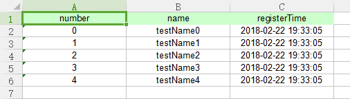
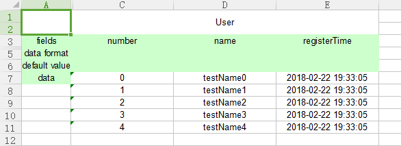
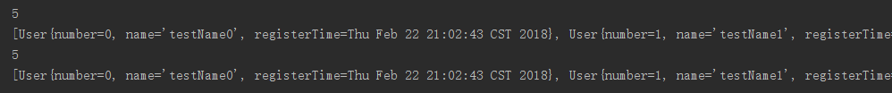

# Editor
```
String filePathName = System.getProperty("user.dir") + "/src/test/resources/editor.xlsx";
List<User> users = new ArrayList<>();
for (int i = 0; i < 5; i++) {
    User user = new User();
    user.setName("testName" + i);
    user.setNumber(i);
    user.setRegisterTime(new Date());
    users.add(user);
}

//CustomEditor write
Editor editorCustom = ExcelFactory.getEditor(ExcelFactory.TYPE_CODE_CUSTOM, filePathName, 1);
editorCustom.writeExcelMetaInfo(User.class, 0);
editorCustom.writeExcelData(users, 0, 1);
editorCustom.flush();
editorCustom.close();

//FormattedEditor write
Editor editorFormatted = ExcelFactory.getEditor(ExcelFactory.TYPE_CODE_FORMATTED, filePathName);
editorFormatted.writeExcelMetaInfo(User.class, 1);
editorFormatted.writeExcelData(users, 1, 0);
editorFormatted.flush();
editorFormatted.close();

//CustomEditor read
Editor editorCustomRead = ExcelFactory.getEditor(ExcelFactory.TYPE_CODE_CUSTOM, filePathName, 1);
System.out.println(editorCustomRead.readExcelDataCount(0));
System.out.println(editorCustomRead.readExcelData(0, 1, 5, User.class));
editorCustomRead.close();

//FormattedEditor read
Editor editorFormattedRead = ExcelFactory.getEditor(ExcelFactory.TYPE_CODE_FORMATTED, filePathName);
System.out.println(editorFormattedRead.readExcelDataCount(1));
System.out.println(editorFormattedRead.readExcelData(1, 0, 5, User.class));
editorFormattedRead.close();
```

result like this

- CustomEditor write



- FormattedEditor write



- Editor read



