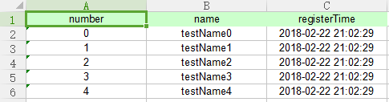
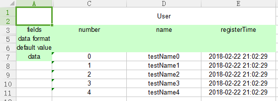

# Writer
```
List<User> users = new ArrayList<>();
for (int i = 0; i < 5; i++) {
    User user = new User();
    user.setName("testName" + i);
    user.setNumber(i);
    user.setRegisterTime(new Date());
    users.add(user);
}

//CustomWriter
String filePathNameCustom = System.getProperty("user.dir") + "/src/test/resources/writerCustom.xlsx";
Writer writerCustom = ExcelFactory.getWriter(ExcelFactory.TYPE_CODE_CUSTOM, filePathNameCustom);
writerCustom.writeExcelMetaInfo(User.class, 0);
writerCustom.writeExcelData(users, 0);
writerCustom.flush();
writerCustom.close();

//FormattedWriter
String filePathNameFormatted = System.getProperty("user.dir") + "/src/test/resources/writerFormatted.xlsx";
Writer writerFormatted = ExcelFactory.getWriter(ExcelFactory.TYPE_CODE_FORMATTED, filePathNameFormatted);
writerFormatted.writeExcelMetaInfo(User.class, 0);
writerFormatted.writeExcelData(users, 0);
writerFormatted.flush();
writerFormatted.close();
```

result like this

- CustomWriter



- FormattedWriter

