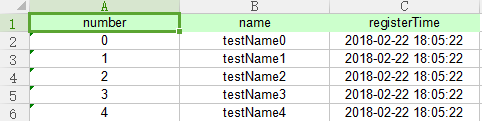
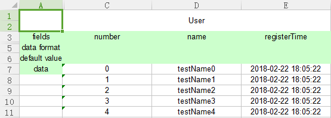
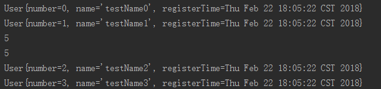

# Reader

file for reader

- CustomReader



- FormattedReader



```
//CustomReader
String filePathNameCustom = System.getProperty("user.dir") + "/src/test/resources/readerCustom.xlsx";
Reader readerCustom = ExcelFactory.getReader(ExcelFactory.TYPE_CODE_CUSTOM, filePathNameCustom, 1);
readerCustom.readExcelData(0, 2, User.class).forEach(System.out::println);
System.out.println(readerCustom.readExcelDataCount(0));
readerCustom.close();

//FormattedReader
String filePathNameFormatted = System.getProperty("user.dir") + "/src/test/resources/readerFormatted.xlsx";
Reader readerFormatted = ExcelFactory.getReader(ExcelFactory.TYPE_CODE_FORMATTED, filePathNameFormatted);
System.out.println(readerFormatted.readExcelDataCount(0));
readerCustom.readExcelData(0, 2, User.class).forEach(System.out::println);
readerFormatted.close();
```

result like this

