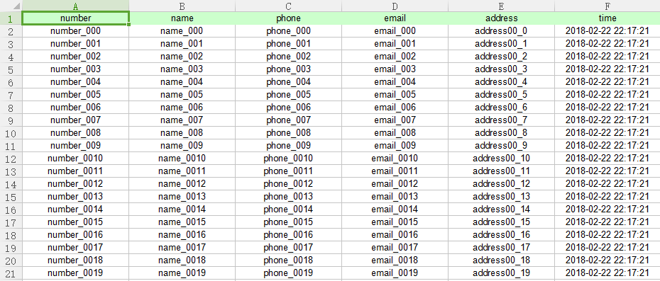

# Custom Editor&Writer&Reader
## Code your entity class
There are two ways. One is the ordinary way, another is to add @Column annotation way.

### 1.Ordinary ways (like class Person):
```
import java.util.Date;

public class Person {
	private String number;
	private String name;
	private String phone;
	private String email;
	private String address;
	private Date time;

	public String getNumber() {
		return number;
	}

	public void setNumber(String number) {
		this.number = number;
	}

	public String getName() {
		return name;
	}

	public void setName(String name) {
		this.name = name;
	}

	public String getPhone() {
		return phone;
	}

	public void setPhone(String phone) {
		this.phone = phone;
	}

	public String getEmail() {
		return email;
	}

	public void setEmail(String email) {
		this.email = email;
	}

	public String getAddress() {
		return address;
	}

	public void setAddress(String address) {
		this.address = address;
	}

	public Date getTime() {
		return time;
	}

	public void setTime(Date time) {
		this.time = time;
	}

	@Override
	public String toString() {
		return "Person{" +
				"number='" + number + '\'' +
				", name='" + name + '\'' +
				", phone='" + phone + '\'' +
				", email='" + email + '\'' +
				", address='" + address + '\'' +
				", time=" + time +
				'}';
	}
}
```

### 2.Annotation ways (like class PersonA):
```
import xuyihao.java2excel.core.entity.custom.annotation.Column;

import java.util.Date;

public class PersonA {
	@Column(column = 0)
	private String number;
	@Column(column = 1)
	private String name;
	@Column(column = 2)
	private String phone;
	@Column(column = 3)
	private String email;
	private String address;
	@Column(column = 4)
	private Date time;

	public String getNumber() {
		return number;
	}

	public void setNumber(String number) {
		this.number = number;
	}

	public String getName() {
		return name;
	}

	public void setName(String name) {
		this.name = name;
	}

	public String getPhone() {
		return phone;
	}

	public void setPhone(String phone) {
		this.phone = phone;
	}

	public String getEmail() {
		return email;
	}

	public void setEmail(String email) {
		this.email = email;
	}

	public String getAddress() {
		return address;
	}

	public void setAddress(String address) {
		this.address = address;
	}

	public Date getTime() {
		return time;
	}

	public void setTime(Date time) {
		this.time = time;
	}

	@Override
	public String toString() {
		return "PersonA{" +
				"number='" + number + '\'' +
				", name='" + name + '\'' +
				", phone='" + phone + '\'' +
				", email='" + email + '\'' +
				", address='" + address + '\'' +
				", time=" + time +
				'}';
	}
}
```

## Write your entity data into excel file using class {CustomWriter}
```
String fileDir = System.getProperty("user.dir") + File.separator + "src/test/resources";
List<Person> people = new ArrayList<>();

for (int i = 0; i < 20; i++) {
    Person person = new Person();
    person.setNumber("number_00" + i);
    person.setName("name_00" + i);
    person.setPhone("phone_00" + i);
    person.setEmail("email_00" + i);
    person.setAddress("address00_" + i);
    person.setTime(DateUtils.currentDateTimeForDate());
    people.add(person);
}

CustomWriter writer = new CustomWriter(fileDir + "/testCustomWriter.xlsx");
writer.writeExcelMetaInfo(Person.class, 0);
writer.writeExcelData(people, 0);
writer.flush();
writer.close();
```
Result:



## Read your entity data from a existing excel file using class {CustomReader}. (Wrote before)
```
String filePathName = System.getProperty("user.dir") + File.separator + "src/test/resources/testCustomReader.xlsx";
List<Person> people = new ArrayList<>();

for (int i = 0; i < 20; i++) {
    Person person = new Person();
    person.setNumber("number_00" + i);
    person.setName("name_00" + i);
    person.setPhone("phone_00" + i);
    person.setEmail("email_00" + i);
    person.setAddress("address00_" + i);
    person.setTime(DateUtils.currentDateTimeForDate());
    people.add(person);
}
CustomWriter writer = new CustomWriter(filePathName);
writer.writeExcelMetaInfo(Person.class, 0);
writer.writeExcelData(people, 0);
writer.flush();
writer.close();

CustomReader reader = new CustomReader(filePathName, 1);
long count = reader.readExcelDataCount(0);
System.out.println(count);
List<Person> personList;
do {
    personList = reader.readExcelData(0, 10, Person.class);
    personList.forEach(System.out::println);
} while (!personList.isEmpty());

reader.refresh();

System.out.println("\r\r-----------------------------\r\r");

Person[] personArray = new Person[10];
int readLength;
while ((readLength = reader.readExcelData(0, personArray, Person.class)) > 0) {
    for (int i = 0; i < readLength; i++) {
        System.out.println(personArray[i]);
    }
}

reader.close();
```
Result:

```
20
Person{number='number_000', name='name_000', phone='phone_000', email='email_000', address='address00_0', time=Thu Feb 22 22:21:58 CST 2018}
Person{number='number_001', name='name_001', phone='phone_001', email='email_001', address='address00_1', time=Thu Feb 22 22:21:58 CST 2018}
Person{number='number_002', name='name_002', phone='phone_002', email='email_002', address='address00_2', time=Thu Feb 22 22:21:58 CST 2018}
Person{number='number_003', name='name_003', phone='phone_003', email='email_003', address='address00_3', time=Thu Feb 22 22:21:58 CST 2018}
Person{number='number_004', name='name_004', phone='phone_004', email='email_004', address='address00_4', time=Thu Feb 22 22:21:58 CST 2018}
Person{number='number_005', name='name_005', phone='phone_005', email='email_005', address='address00_5', time=Thu Feb 22 22:21:58 CST 2018}
Person{number='number_006', name='name_006', phone='phone_006', email='email_006', address='address00_6', time=Thu Feb 22 22:21:58 CST 2018}
Person{number='number_007', name='name_007', phone='phone_007', email='email_007', address='address00_7', time=Thu Feb 22 22:21:58 CST 2018}
Person{number='number_008', name='name_008', phone='phone_008', email='email_008', address='address00_8', time=Thu Feb 22 22:21:58 CST 2018}
Person{number='number_009', name='name_009', phone='phone_009', email='email_009', address='address00_9', time=Thu Feb 22 22:21:58 CST 2018}
Person{number='number_0010', name='name_0010', phone='phone_0010', email='email_0010', address='address00_10', time=Thu Feb 22 22:21:58 CST 2018}
Person{number='number_0011', name='name_0011', phone='phone_0011', email='email_0011', address='address00_11', time=Thu Feb 22 22:21:58 CST 2018}
Person{number='number_0012', name='name_0012', phone='phone_0012', email='email_0012', address='address00_12', time=Thu Feb 22 22:21:58 CST 2018}
Person{number='number_0013', name='name_0013', phone='phone_0013', email='email_0013', address='address00_13', time=Thu Feb 22 22:21:58 CST 2018}
Person{number='number_0014', name='name_0014', phone='phone_0014', email='email_0014', address='address00_14', time=Thu Feb 22 22:21:58 CST 2018}
Person{number='number_0015', name='name_0015', phone='phone_0015', email='email_0015', address='address00_15', time=Thu Feb 22 22:21:58 CST 2018}
Person{number='number_0016', name='name_0016', phone='phone_0016', email='email_0016', address='address00_16', time=Thu Feb 22 22:21:58 CST 2018}
Person{number='number_0017', name='name_0017', phone='phone_0017', email='email_0017', address='address00_17', time=Thu Feb 22 22:21:58 CST 2018}
Person{number='number_0018', name='name_0018', phone='phone_0018', email='email_0018', address='address00_18', time=Thu Feb 22 22:21:58 CST 2018}
Person{number='number_0019', name='name_0019', phone='phone_0019', email='email_0019', address='address00_19', time=Thu Feb 22 22:21:58 CST 2018}

Person{number='number_000', name='name_000', phone='phone_000', email='email_000', address='address00_0', time=Thu Feb 22 22:21:58 CST 2018}
Person{number='number_001', name='name_001', phone='phone_001', email='email_001', address='address00_1', time=Thu Feb 22 22:21:58 CST 2018}
Person{number='number_002', name='name_002', phone='phone_002', email='email_002', address='address00_2', time=Thu Feb 22 22:21:58 CST 2018}
Person{number='number_003', name='name_003', phone='phone_003', email='email_003', address='address00_3', time=Thu Feb 22 22:21:58 CST 2018}
Person{number='number_004', name='name_004', phone='phone_004', email='email_004', address='address00_4', time=Thu Feb 22 22:21:58 CST 2018}
Person{number='number_005', name='name_005', phone='phone_005', email='email_005', address='address00_5', time=Thu Feb 22 22:21:58 CST 2018}
Person{number='number_006', name='name_006', phone='phone_006', email='email_006', address='address00_6', time=Thu Feb 22 22:21:58 CST 2018}
Person{number='number_007', name='name_007', phone='phone_007', email='email_007', address='address00_7', time=Thu Feb 22 22:21:58 CST 2018}
Person{number='number_008', name='name_008', phone='phone_008', email='email_008', address='address00_8', time=Thu Feb 22 22:21:58 CST 2018}
Person{number='number_009', name='name_009', phone='phone_009', email='email_009', address='address00_9', time=Thu Feb 22 22:21:58 CST 2018}
Person{number='number_0010', name='name_0010', phone='phone_0010', email='email_0010', address='address00_10', time=Thu Feb 22 22:21:58 CST 2018}
Person{number='number_0011', name='name_0011', phone='phone_0011', email='email_0011', address='address00_11', time=Thu Feb 22 22:21:58 CST 2018}
Person{number='number_0012', name='name_0012', phone='phone_0012', email='email_0012', address='address00_12', time=Thu Feb 22 22:21:58 CST 2018}
Person{number='number_0013', name='name_0013', phone='phone_0013', email='email_0013', address='address00_13', time=Thu Feb 22 22:21:58 CST 2018}
Person{number='number_0014', name='name_0014', phone='phone_0014', email='email_0014', address='address00_14', time=Thu Feb 22 22:21:58 CST 2018}
Person{number='number_0015', name='name_0015', phone='phone_0015', email='email_0015', address='address00_15', time=Thu Feb 22 22:21:58 CST 2018}
Person{number='number_0016', name='name_0016', phone='phone_0016', email='email_0016', address='address00_16', time=Thu Feb 22 22:21:58 CST 2018}
Person{number='number_0017', name='name_0017', phone='phone_0017', email='email_0017', address='address00_17', time=Thu Feb 22 22:21:58 CST 2018}
Person{number='number_0018', name='name_0018', phone='phone_0018', email='email_0018', address='address00_18', time=Thu Feb 22 22:21:58 CST 2018}
Person{number='number_0019', name='name_0019', phone='phone_0019', email='email_0019', address='address00_19', time=Thu Feb 22 22:21:58 CST 2018}
```

