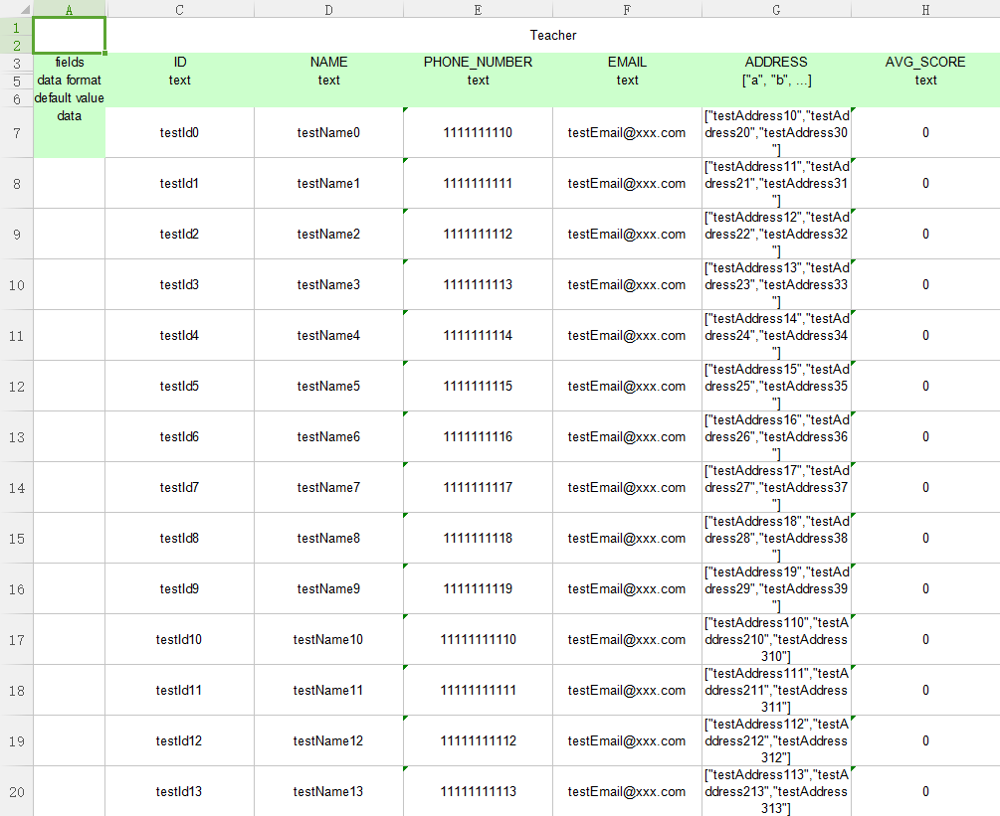

# Formatted Editor&Writer&Reader
## Code your entity class
There are two ways. One is code your entity class like you always do, another way is to add @Model/@Attribute annotation.

### 1.Ordinary ways (like class Student):
```
import java.util.List;

/**
 * Created by xuyh at 2017/12/30 16:44.
 */
public class Student {
	public static final String COLLECTION_NAME = "Student";
	public static String FIELD_CODE_NAME = "name";
	private static String KIND = "UNKNOWN";
	private String name;
	private String number;
	private String phoneNumber;
	private String email;
	private int score;
	private double avgScore;
	private List<String> addresses;

	public Student() {
	}

	public Student(String name, String number, String phoneNumber, String email) {
		this.name = name;
		this.number = number;
		this.phoneNumber = phoneNumber;
		this.email = email;
	}

	public String getName() {
		return name;
	}

	public void setName(String name) {
		this.name = name;
	}

	public String getNumber() {
		return number;
	}

	public void setNumber(String number) {
		this.number = number;
	}

	public String getPhoneNumber() {
		return phoneNumber;
	}

	public void setPhoneNumber(String phoneNumber) {
		this.phoneNumber = phoneNumber;
	}

	public String getEmail() {
		return email;
	}

	public void setEmail(String email) {
		this.email = email;
	}

	public List<String> getAddresses() {
		return addresses;
	}

	public void setAddresses(List<String> addresses) {
		this.addresses = addresses;
	}

	public int getScore() {
		return score;
	}

	public void setScore(int score) {
		this.score = score;
	}

	public double getAvgScore() {
		return avgScore;
	}

	public void setAvgScore(double avgScore) {
		this.avgScore = avgScore;
	}

	@Override
	public String toString() {
		return "Student{" +
				"name='" + name + '\'' +
				", number='" + number + '\'' +
				", phoneNumber='" + phoneNumber + '\'' +
				", email='" + email + '\'' +
				", score=" + score +
				", avgScore=" + avgScore +
				", addresses=" + addresses +
				'}';
	}
}

```  

### 2.annotation ways (like class Teacher):
```
import xuyihao.java2excel.core.entity.formatted.model.annotation.Attribute;
import xuyihao.java2excel.core.entity.formatted.model.annotation.Model;

import java.util.List;

/**
 * Created by xuyh at 2018/1/3 13:41.
 */
@Model(name = "Teacher")
public class Teacher {
	public static final String COLLLECTION_NAME = "Teacher";
	public static final String FIELD_CODE_ID = "id";
	public static final String FIELD_CODE_NAME = "name";
	public static final String FIELD_CODE_PHONE_NUMBER = "phoneNumber";
	public static final String FIELD_CODE_EMAIL = "email";
	public static final String FIELD_CODE_ADDRESS = "address";

	@Attribute(attrName = "ID", attrType = "String", formatInfo = "text")
	private String id;
	@Attribute(attrName = "NAME", attrType = "String", formatInfo = "text")
	private String name;
	@Attribute(attrName = "PHONE_NUMBER", attrType = "String", formatInfo = "text")
	private String phoneNumber;
	@Attribute(attrName = "EMAIL", attrType = "String", formatInfo = "text")
	private String email;
	@Attribute(attrName = "ADDRESS", attrType = "List<String>", formatInfo = "[\"a\", \"b\", ...]")
	private List<String> address;
	@Attribute(attrName = "AVG_SCORE", attrType = "Integer", formatInfo = "text")
	private int avgScore;

	public Teacher() {
	}

	public Teacher(String name, String phoneNumber, String email) {
		this.name = name;
		this.phoneNumber = phoneNumber;
		this.email = email;
	}

	private Teacher(String id, String name) {
		this.id = id;
		this.name = name;
	}

	public String getId() {
		return id;
	}

	public void setId(String id) {
		this.id = id;
	}

	public String getName() {
		return name;
	}

	public void setName(String name) {
		this.name = name;
	}

	public String getPhoneNumber() {
		return phoneNumber;
	}

	public void setPhoneNumber(String phoneNumber) {
		this.phoneNumber = phoneNumber;
	}

	public String getEmail() {
		return email;
	}

	public void setEmail(String email) {
		this.email = email;
	}

	public List<String> getAddress() {
		return address;
	}

	public void setAddress(List<String> address) {
		this.address = address;
	}

	public int getAvgScore() {
		return avgScore;
	}

	public void setAvgScore(int avgScore) {
		this.avgScore = avgScore;
	}

	@Override
	public String toString() {
		return "Teacher{" +
				"id='" + id + '\'' +
				", name='" + name + '\'' +
				", phoneNumber='" + phoneNumber + '\'' +
				", email='" + email + '\'' +
				", address=" + address +
				", avgScore=" + avgScore +
				'}';
	}
}
```

## Write your entity data into excel file using class {FormattedWriter}
```
//Define your data.
List<Teacher> teachers = new ArrayList<>();
for (int i = 0; i < 100; i++) {
    Teacher teacher = new Teacher();
    teacher.setId("testId" + i);
    teacher.setName("testName" + i);
    teacher.setEmail("testEmail@xxx.com");
    teacher.setPhoneNumber("111111111" + i);
    teacher.setAddress(Arrays.asList("testAddress1" + i, "testAddress2" + i, "testAddress3" + i));
    teachers.add(teacher);
}

//Get a formattedWriter instance with given file path name.(File can be inexistent).
FormattedWriter formattedWriter = new FormattedWriter("D:\\complex.xlsx");

//Set the formattedWriter language to write meta data with.
formattedWriter.setLanguage("en_US");

//Write your entity meta data.
formattedWriter.writeExcelModel(Teacher.class, 0);
for (int i = 0; i < 100; i += 10) {
    List<Teacher> t = new ArrayList<>();
    for (int j = i; j < i + 10; j++) {
        t.add(teachers.get(j));
    }
    //Write your entity data by steps.
    formattedWriter.writeExcelData(t, 0);
}

//Write file into the disk.
formattedWriter.flush();

//Close the java2excel formattedWriter.
formattedWriter.close();
```

Result:



## Read your entity data from a existing excel file using class {FormattedReader}. (Wrote before)
```
//Get a formattedReader instance with given file path name. (File must exists)
FormattedReader formattedReader = new FormattedReader("D:\\complex.xlsx");

//Get your entity class info in the excel file (sheet number 1)
Class<?> clazz = formattedReader.readExcelJavaClass(1);

Assert.assertNotNull(clazz);
System.out.println(JsonUtils.obj2JsonStr(clazz));

//Get your entity data count from the excel file.
int count = formattedReader.readExcelDataCount(1);

Assert.assertNotEquals(1, count);
System.out.println(count);

System.out.println("\n----------------------------------------------------------------------read list");
int listCount;
do {
    //Get data list, size 10.
    List<Student> studentList = formattedReader.readExcelData(1, 10, Student.class);
    listCount = studentList.size();
    studentList.forEach(student -> System.out.println(JsonUtils.obj2JsonStr(student)));
} while (listCount > 0);


//Refresh the formattedReader. Read position reset to 0 (next read will start from the begining of the excel file data).
formattedReader.refresh();

System.out.println("\n----------------------------------------------------------------------read array");
Student[] students = new Student[10];
int arrayCount;
//Get data into your entity array
while ((arrayCount = formattedReader.readExcelData(1, students, Student.class)) > 0) {
    for (int i = 0; i < arrayCount; i++) {
        System.out.println(JsonUtils.obj2JsonStr(students[i]));
    }
}

//Close the java2excel formattedReader.
formattedReader.close();
```

Result:

```
"xuyihao.java2excel.entity.Student"
100

----------------------------------------------------------------------read list
{"name":"name1","number":"number1","phoneNumber":"phoneNumber1","email":"email1","score":0,"avgScore":0.0,"addresses":["address01","address11"]}
{"name":"name2","number":"number2","phoneNumber":"phoneNumber2","email":"email2","score":0,"avgScore":0.0,"addresses":["address02","address12"]}
{"name":"name3","number":"number3","phoneNumber":"phoneNumber3","email":"email3","score":0,"avgScore":0.0,"addresses":["address03","address13"]}
{"name":"name4","number":"number4","phoneNumber":"phoneNumber4","email":"email4","score":0,"avgScore":0.0,"addresses":["address04","address14"]}
{"name":"name5","number":"number5","phoneNumber":"phoneNumber5","email":"email5","score":0,"avgScore":0.0,"addresses":["address05","address15"]}
... ...

----------------------------------------------------------------------read array
{"name":"name1","number":"number1","phoneNumber":"phoneNumber1","email":"email1","score":0,"avgScore":0.0,"addresses":["address01","address11"]}
{"name":"name2","number":"number2","phoneNumber":"phoneNumber2","email":"email2","score":0,"avgScore":0.0,"addresses":["address02","address12"]}
{"name":"name3","number":"number3","phoneNumber":"phoneNumber3","email":"email3","score":0,"avgScore":0.0,"addresses":["address03","address13"]}
{"name":"name4","number":"number4","phoneNumber":"phoneNumber4","email":"email4","score":0,"avgScore":0.0,"addresses":["address04","address14"]}
{"name":"name5","number":"number5","phoneNumber":"phoneNumber5","email":"email5","score":0,"avgScore":0.0,"addresses":["address05","address15"]}
... ...
```

## Using class {FormattedEditor} to read & write an excel file with your defined entity class.
```
// Get an editor instance by existing excel file.
FormattedEditor editor = new FormattedEditor(filePathName);

// Set editor language for meta data.
editor.setLanguage(Languages.ZH_CN.getLanguage());

// Read data count.
int count = editor.readExcelDataCount(0);
System.out.println(count);

// Read data.
List<Teacher> readTeachers = editor.readExcelData(0, 0, 10, Teacher.class);
readTeachers.forEach(teacher -> System.out.println(JsonUtils.obj2JsonStr(teacher)));

List<Teacher> teachers = new ArrayList<>();
for (int i = 100; i < 120; i++) {
    Teacher teacher = new Teacher();
    teacher.setId("testId" + i);
    teacher.setName("testName" + i);
    teacher.setEmail("testEmail@xxx.com");
    teacher.setPhoneNumber("111111111" + i);
    teacher.setAddress(Arrays.asList("testAddress1" + i, "testAddress2" + i, "testAddress3" + i));
    teachers.add(teacher);
}

//Write data into the excel.
editor.writeExcelData(teachers, 0, count + 10);

//Write changes into another new excel file.
editor.flush("D:\\test2.xlsx");

//Close the editor
editor.close();
```