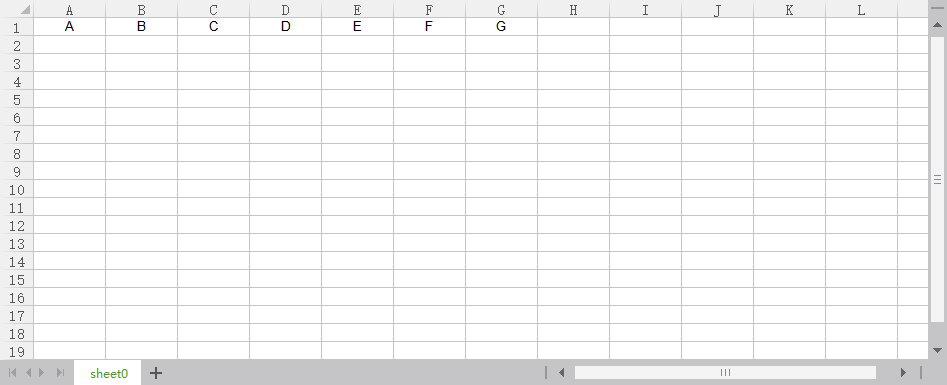
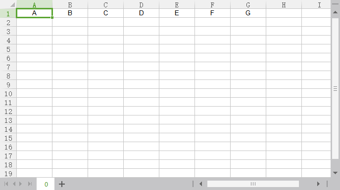
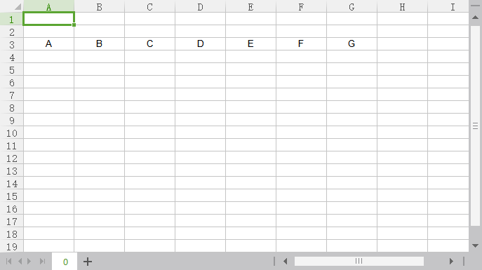
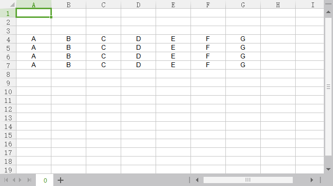
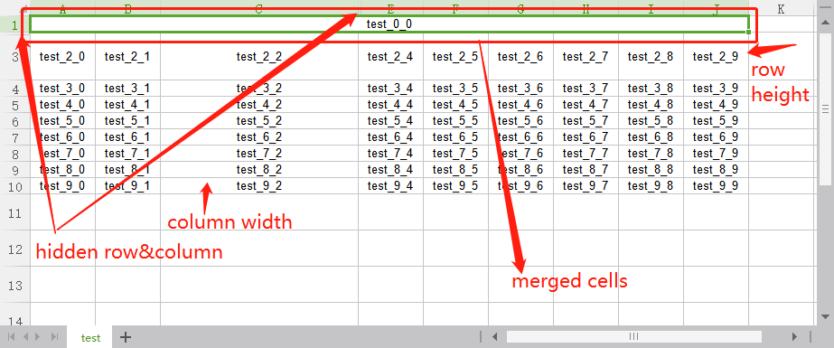
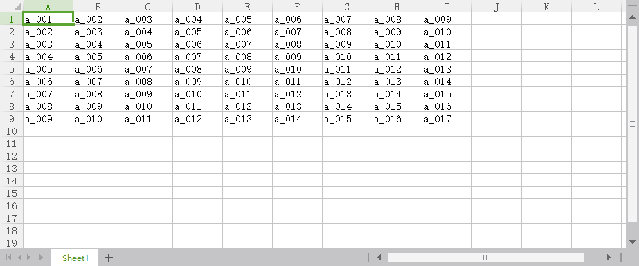
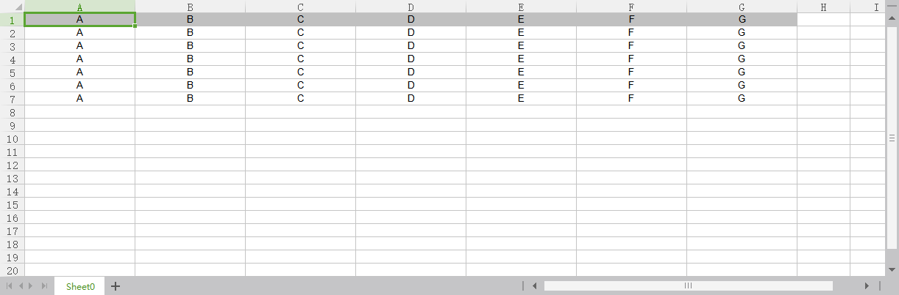
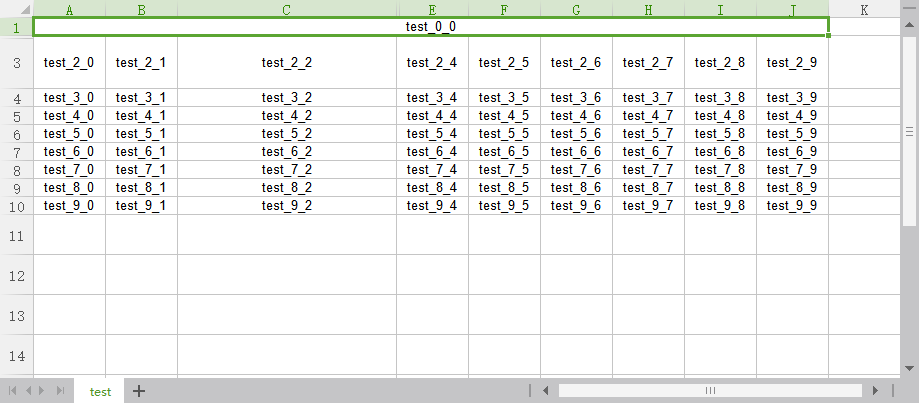

# Free Editor&Writer&Reader

## FreeWriter

Free Writer is a tool for writing data into excel file freely for user.

### Getting instance
```
1.
FreeWriter writer = new FreeWriter("/home/test/FreeWriter.xlsx");

2.
FreeWriter writer = ExcelFactory.getFreeWriter("/home/test/FreeWriter.xlsx");
```
### Create excel with insert data.
```
//define cell data list
List<CellData> cellDataList = Arrays.asList(
        new CellData(0, 0, "A", CellStyle.CELL_STYLE_TYPE_VALUE),
        new CellData(0, 1, "B", CellStyle.CELL_STYLE_TYPE_VALUE),
        new CellData(0, 2, "C", CellStyle.CELL_STYLE_TYPE_VALUE),
        new CellData(0, 3, "D", CellStyle.CELL_STYLE_TYPE_VALUE),
        new CellData(0, 4, "E", CellStyle.CELL_STYLE_TYPE_VALUE),
        new CellData(0, 5, "F", CellStyle.CELL_STYLE_TYPE_VALUE),
        new CellData(0, 6, "G", CellStyle.CELL_STYLE_TYPE_VALUE)
);
//create excel with insert data into sheet number 0 by name "sheet0"
writer.createExcel(cellDataList, 0, "sheet0");
```

Result:



### Write excel data
```
//define cell data list
List<CellData> cellDataList = Arrays.asList(
        new CellData(0, 0, "A", CellStyle.CELL_STYLE_TYPE_VALUE),
        new CellData(0, 1, "B", CellStyle.CELL_STYLE_TYPE_VALUE),
        new CellData(0, 2, "C", CellStyle.CELL_STYLE_TYPE_VALUE),
        new CellData(0, 3, "D", CellStyle.CELL_STYLE_TYPE_VALUE),
        new CellData(0, 4, "E", CellStyle.CELL_STYLE_TYPE_VALUE),
        new CellData(0, 5, "F", CellStyle.CELL_STYLE_TYPE_VALUE),
        new CellData(0, 6, "G", CellStyle.CELL_STYLE_TYPE_VALUE)
);
//write cell data list into sheet number 0.
writer.writeExcelData(cellDataList, 0);
```

Result:



### Write single row data.
```
//Define single row data map.
Map<Integer, Object> map = new HashMap<>();
map.put(0, "A");
map.put(1, "B");
map.put(2, "C");
map.put(3, "D");
map.put(4, "E");
map.put(5, "F");
map.put(6, "G");

//Write map data into sheet number 0 at row number 2.
writer.writeExcelDataDirectly(map, 0, 2);
```

Result:




### Write multiple row data.
```
//Define multiple row data map list.
Map<Integer, Object> map = new HashMap<>();
map.put(0, "A");
map.put(1, "B");
map.put(2, "C");
map.put(3, "D");
map.put(4, "E");
map.put(5, "F");
map.put(6, "G");
List<Map<Integer, Object>> mapList = Arrays.asList(map, map, map, map);
		
//Write data into sheet number 0 begin at row number 3.
writer.writeExcelDataDirectly(mapList, 0, 3));
```

Result:




### Other operations
```
FreeWriter writer = new FreeWriter("/home/test/FreeWriter.xlsx");
List<CellData> cellDataList = new ArrayList<>();
for (int row = 0; row < 10; row++) {
    for (int column = 0; column < 10; column++) {
        cellDataList.add(new CellData(row, column, "test_" + row + "_" + column, CellStyle.CELL_STYLE_TYPE_VALUE));
    }
}
writer.createExcel(cellDataList, 0, "test");

//merge cells of sheet number 0, at range first row 0 last row 0, first column 0 last colum 9.
writer.mergeExcelCells(0, 0, 0, 0, 9);

//set default row height of value 600
writer.setExcelDefaultRowHeight(0, 600);

//set row number 2 height 800
writer.setExcelRowHeight(0, 2, 800);

//set column number 2 width 7000
writer.setExcelColumnWidth(0, 2, 7000);

//hide row number 1(height value 0)
writer.hideExcelRow(0, 1);

//hide column number 3(width value 0)
writer.hideExcelColumn(0, 3);

//flush changes into workbook
writer.flush();

//close workbook
writer.close();
```

Result:



## FreeReader

Free Reader is a tool for reading excel file data freely for user.

### excel content example:



### Read data as {CellData}.
```
FreeReader reader = new FreeReader("/home/test/FreeReader.xlsx");

//read data in sheet number 0, row number 0, column number 0 as {CellData}.
CellData cellData = reader.readExcelCellData(0, 0, 0);

System.out.println(cellData);
reader.close();
```

Result:
```
CellData{row=0, column=0, data=a_001, cellStyle=null}
```

### Read data as {String}.
```
FreeReader reader = new FreeReader("/home/test/FreeReader.xlsx");

//read data in sheet number 0, row number 0, column number 0 as {String}.
String str = reader.readExcelData(0, 0, 0);

System.out.println(str);
reader.close();
```

Result:
```
a_001
```

## FreeEditor

- FreeEditor is a tool for editing excel file data (including read&write) freely for user.
- Detail usage information is like FreeWriter & FreeReader.

### writing example
```
@Test
public void testWrite() {
    FreeEditor editor1 = new FreeEditor("/opt/test/FreeEditor.xlsx");

    Assert.assertTrue(editor1.createExcel(Arrays.asList(
            new CellData(0, 0, "A", CellStyle.CELL_STYLE_TYPE_ROW_HEADER_GREY),
            new CellData(0, 1, "B", CellStyle.CELL_STYLE_TYPE_ROW_HEADER_GREY),
            new CellData(0, 2, "C", CellStyle.CELL_STYLE_TYPE_ROW_HEADER_GREY),
            new CellData(0, 3, "D", CellStyle.CELL_STYLE_TYPE_ROW_HEADER_GREY),
            new CellData(0, 4, "E", CellStyle.CELL_STYLE_TYPE_ROW_HEADER_GREY),
            new CellData(0, 5, "F", CellStyle.CELL_STYLE_TYPE_ROW_HEADER_GREY),
            new CellData(0, 6, "G", CellStyle.CELL_STYLE_TYPE_ROW_HEADER_GREY)), 0, "Sheet0"));

    Assert.assertTrue(editor1.writeExcelData(Arrays.asList(
            new CellData(1, 0, "A", CellStyle.CELL_STYLE_TYPE_VALUE),
            new CellData(1, 1, "B", CellStyle.CELL_STYLE_TYPE_VALUE),
            new CellData(1, 2, "C", CellStyle.CELL_STYLE_TYPE_VALUE),
            new CellData(1, 3, "D", CellStyle.CELL_STYLE_TYPE_VALUE),
            new CellData(1, 4, "E", CellStyle.CELL_STYLE_TYPE_VALUE),
            new CellData(1, 5, "F", CellStyle.CELL_STYLE_TYPE_VALUE),
            new CellData(1, 6, "G", CellStyle.CELL_STYLE_TYPE_VALUE)), 0));

    Map<Integer, Object> map = new HashMap<>();
    map.put(0, "A");
    map.put(1, "B");
    map.put(2, "C");
    map.put(3, "D");
    map.put(4, "E");
    map.put(5, "F");
    map.put(6, "G");
    Assert.assertTrue(editor1.writeExcelDataDirectly(map, 0, 2));

    List<Map<Integer, Object>> mapList = Arrays.asList(
            map, map, map, map);
    Assert.assertTrue(editor1.writeExcelDataDirectly(mapList, 0, 3));

    for (int i = 0; i < 7; i++) {
        Assert.assertTrue(editor1.setExcelColumnWidth(0, i, 4800));
    }

    Assert.assertTrue(editor1.flush());
    Assert.assertTrue(editor1.close());
}
```

Result:



### reading example
```
@Test
public void testRead() {
    FreeEditor editor = new FreeEditor("C:\\Users\\Johnson\\Desktop\\FreeEditor.xlsx");
    CellData data = editor.readExcelCellData(0, 0, 0);
    Assert.assertNotNull(data);
    System.out.println(data);
    String str = editor.readExcelData(0, 0, 0);
    Assert.assertNotNull(str);
    System.out.println(str);
}
```

Result:
```
CellData{row=0, column=0, data=test_0_0, cellStyle=null}
test_0_0
```


### Other operations
```
@Test
public void testOther() {
    FreeEditor editor = new FreeEditor("C:\\Users\\Johnson\\Desktop\\FreeEditor.xlsx");
    List<CellData> cellDataList = new ArrayList<>();
    for (int row = 0; row < 10; row++) {
        for (int column = 0; column < 10; column++) {
            cellDataList.add(new CellData(row, column, "test_" + row + "_" + column, CellStyle.CELL_STYLE_TYPE_VALUE));
        }
    }
    Assert.assertTrue(editor.createExcel(cellDataList, 0, "test"));
    Assert.assertTrue(editor.mergeExcelCells(0, 0, 0, 0, 9));
    Assert.assertTrue(editor.setExcelDefaultRowHeight(0, 600));
    Assert.assertTrue(editor.setExcelRowHeight(0, 2, 800));
    Assert.assertTrue(editor.setExcelColumnWidth(0, 2, 7000));
    Assert.assertTrue(editor.hideExcelRow(0, 1));
    Assert.assertTrue(editor.hideExcelColumn(0, 3));
    Assert.assertTrue(editor.flush());
    Assert.assertTrue(editor.close());
}
```

Result:
